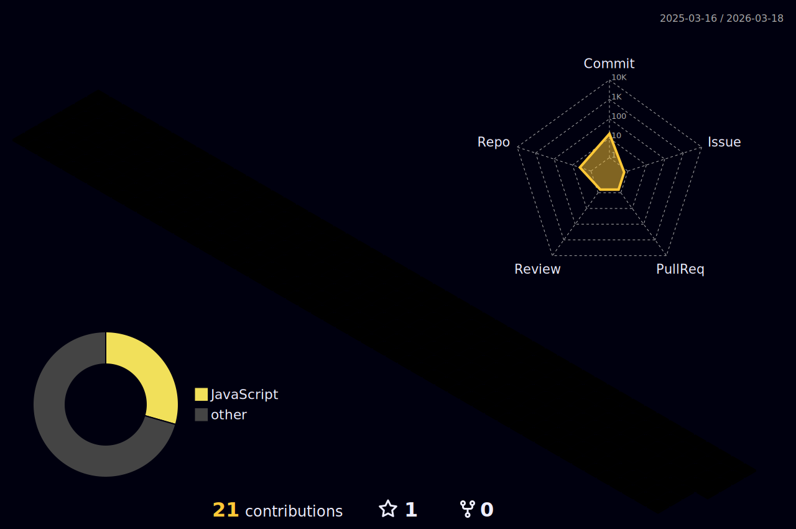

<h1 align="center">Lucas Corrêa</h1>

  Desenvolvedor Full Stack · Professor de TI · Especialista em Produto Digital

---

---
<
## Sobre

- Atuação em desenvolvimento full stack com JavaScript e TypeScript
- Professor de Tecnologia no SENAI e SENAC; criador do canal Professor Corrêa
- Especialista em acessibilidade, UI/UX, clean code e liderança de produtos digitais
- Pós-graduação em Engenharia de Software e Digital Product Leadership
- Experiência em automação de processos e integração de sistemas utilizando Python

## Sem projetos em destaque... Ainda.

- [Toque AI](https://toqueai.com.br/) – Plataforma de QR Code para identificação e gestão de pets, pessoas e objetos
- [Suporte de Domingo](https://suportededomingo.com.br/) – Soluções digitais e agendamento personalizado
- [Code Trouble](https://codetrouble.com.br) – Comunidade aberta para desenvolvedores e troca de conhecimento

## Contato

- [Discord](https://www.discord.gg/muuuuuuuuuuuuuuu)
- [Instagram - k_cofee_](https://www.instagram.com/k_cofee_)

---

> Educar é tornar o saber algo com voz, sentido e sentimento.

<!--
**cofeezz/cofeezz** is a ✨ _special_ ✨ repository because its `README.md` (this file) appears on your GitHub profile.

Here are some ideas to get you started:

- 🔭 I’m currently working on ...
- 🌱 I’m currently learning ...
- 👯 I’m looking to collaborate on ...
- 🤔 I’m looking for help with ...
- 💬 Ask me about ...
- 📫 How to reach me: ...
- 😄 Pronouns: ...
- ⚡ Fun fact: ...
-->
